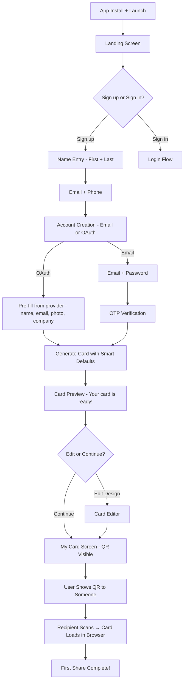
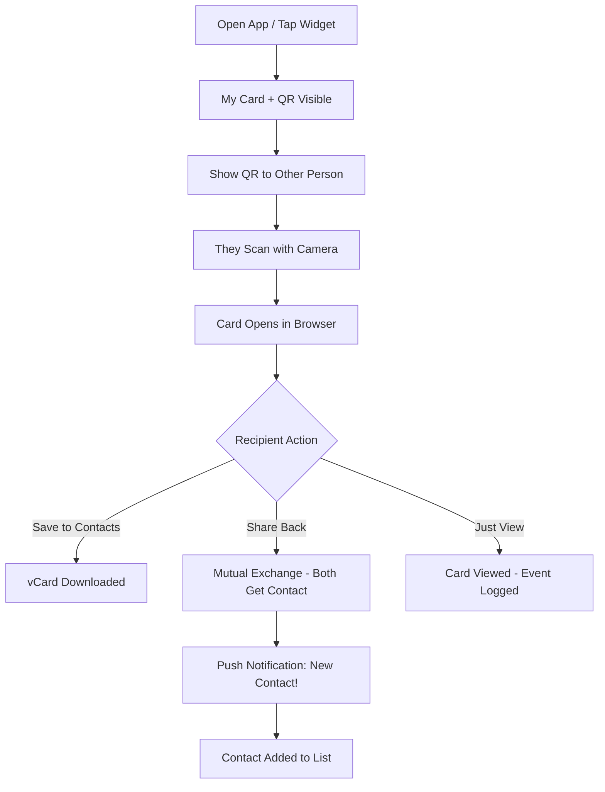
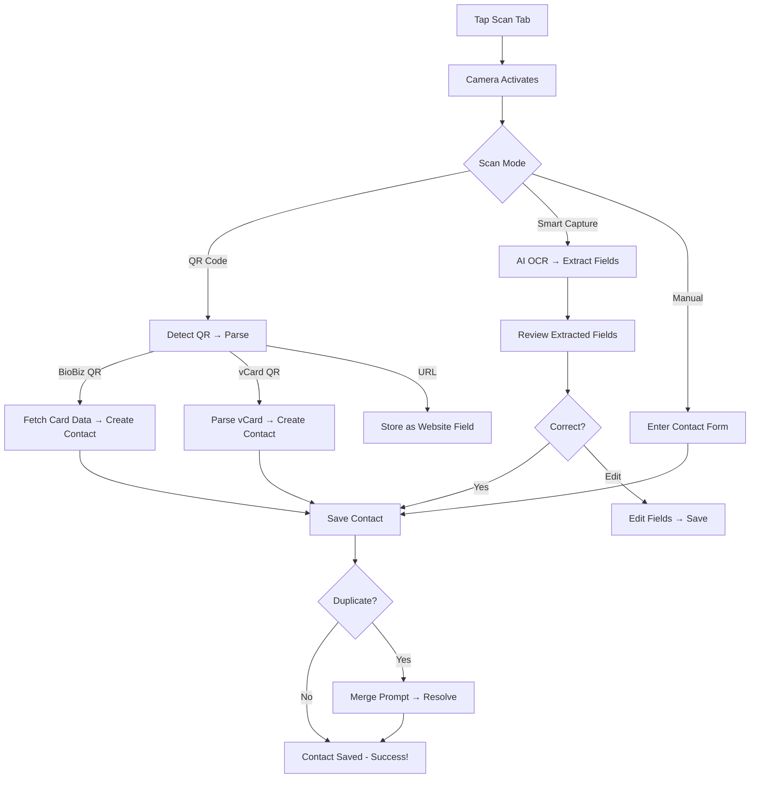
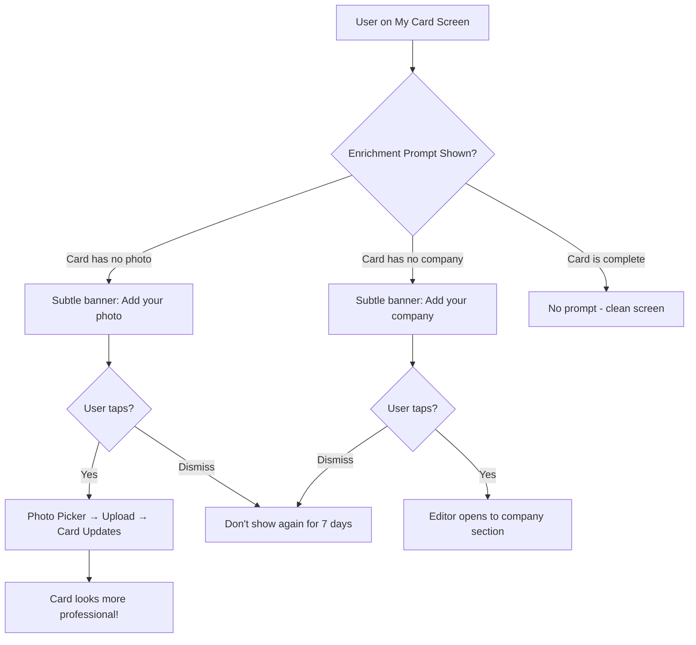

# UX Design Specification BioBiz

**Author:** User
**Date:** 2026-03-12

---

## Executive Summary

### Project Vision

BioBiz is a digital business card platform replicating Blinq's complete feature set — card creation, multi-channel sharing, contact scanning, AI meeting notes, and contact management — built with Flutter (mobile) and Next.js (web) on Supabase. The strategic approach is feature-parity first, with the core UX differentiator being a faster, frictionless experience that addresses Blinq's primary user complaint: lengthy signup and data collection.

### Target Users

**Primary audience:** Professionals, freelancers, entrepreneurs, and sales teams who network regularly.

**User profile:**
- **Tech comfort:** "Just works" crowd — not power users. Every interaction must be intuitive with zero learning curve
- **Usage context:** Everyday networking equally important as events — 1-on-1 meetings, office settings, casual introductions, not just conferences
- **Devices:** Truly equal Android and iOS priority — UX must feel native on both platforms
- **Core need:** Exchange contact information fast, without fumbling with paper cards or manual phone entry

**User frustration to solve:** Long signup and data collection processes. Users want a working digital card immediately, not after a 9-step gauntlet.

### Key Design Challenges

1. **Onboarding length vs. card quality** — The PRD defines a 9-step onboarding wizard, but the #1 user frustration with Blinq is lengthy signup. The UX must minimize required steps to reach a functional card while still producing a professional-looking result. Progressive enrichment post-signup is the path forward.

2. **Feature density vs. simplicity** — The card editor supports 22+ social link types, drag-reorderable fields, multiple image layouts, color customization, and accreditations. For a "just works" audience, this complexity must be layered — simple defaults with advanced options discoverable but not overwhelming.

3. **Instant sharing in casual contexts** — Everyday networking (hallway conversations, coffee meetings) demands card sharing in 1-2 seconds. The QR code must be immediately accessible, not buried behind tabs or menus.

4. **True cross-platform parity** — Material 3 as the design foundation must feel natural on both Android and iOS without alienating either user base. No platform-specific UX shortcuts.

### Design Opportunities

1. **Progressive onboarding** — Deliver a usable card in 2-3 steps (name, email, account creation), then guide users to enrich their card post-signup through contextual prompts. This directly addresses the primary Blinq pain point and can be the key experiential differentiator.

2. **Speed-first sharing architecture** — Make the QR code the hero of the home screen. App open = card + QR visible immediately. Combined with the home screen widget, sharing becomes a 1-second action.

3. **Smart defaults and auto-population** — Auto-detect company logos, pre-fill from OAuth profile data (Google/Microsoft/Apple), suggest color themes based on logo colors, and minimize manual input at every opportunity.

## Core User Experience

### Defining Experience

The core BioBiz experience is the **card share moment** — the interaction where a user shows their QR code and another person scans it to receive their contact information. This is the action users will perform most frequently and the one that must be absolutely flawless. Everything else in the app (card creation, editing, contact management) exists in service of making this moment faster and more reliable.

**Core loop:** Open app → Show QR → Other person scans → They get your card → They share back → Mutual contact created.

The defining metric is **time-to-share**: from app launch to a scannable QR code visible on screen. Target: under 1 second.

### Platform Strategy

- **Primary platform:** Mobile app (Flutter) — Android and iOS with true feature and UX parity
- **Secondary platform:** Web card viewer (Next.js SSR) — the recipient's experience when they scan a QR code
- **Input mode:** Touch-first. All core interactions designed for one-handed, thumb-reachable use
- **Cross-platform design:** Material 3 foundation with adaptive styling to feel native on both platforms. No platform-specific UX shortcuts — identical feature set and interaction patterns
- **Home screen widget:** QR code widget as a key accelerator — share without even opening the app
- **Offline:** QR code display works offline (nice-to-have but supported by architecture — QR generated client-side from cached card URL). Online required for sharing via messaging channels and card exchange

### Effortless Interactions

| Interaction | Target Experience |
|---|---|
| **Show your QR** | App opens directly to card + QR. Zero taps from launch to scannable code |
| **Scan someone's QR** | One tap to scanner from home screen. Camera activates instantly |
| **Receive a card** | Scan QR → card loads in browser < 1 second. Save to contacts with one tap |
| **Share back (mutual exchange)** | After viewing someone's card, prominent "Share my card back" CTA triggers mutual exchange with one tap |
| **Create first card** | Minimal onboarding (name + email + account) → working card generated with smart defaults |
| **Edit card later** | Contextual prompts ("Add your photo to make your card stand out") surface at natural moments, not forced during setup |
| **Add a contact** | Scanned contacts auto-populate. Manual entry is the fallback, not the default path |

### Critical Success Moments

1. **First share** — The moment a new user shows their QR code to someone for the first time. If this feels fast and professional, they're hooked. If it's clunky or the card looks bare, they'll abandon the app.

2. **Mutual exchange** — When both parties walk away with each other's contact info saved. This is the "magic moment" that justifies the app's existence over simply texting a phone number.

3. **Card first impression** — When a recipient scans the QR and sees the card in their browser. The card must load instantly, look polished, and make saving/sharing back effortless. This is BioBiz's shop window — it sells the app to non-users.

4. **Progressive enrichment** — The moment a user adds their photo, company logo, or social links and sees their card transform from basic to professional. This drives engagement and retention without front-loading the effort.

### Experience Principles

1. **Share-first, always** — Every design decision is evaluated against: "Does this make sharing faster or better?" The QR code is the hero. The share moment is the product.

2. **Zero-thought interactions** — Core actions (show QR, view card, scan contact) require no decision-making. Users act on muscle memory and instinct. If a user has to think about how to do something, the design has failed.

3. **Progressive depth** — Simple on the surface, powerful underneath. New users see a clean, minimal interface. Returning users discover editing depth, social links, AI features, and premium options at their own pace through contextual prompts — never through forced tutorials or feature dumps.

4. **Two-way exchange** — Sharing isn't one-directional. The receive-side experience (web card viewer) is as polished as the send-side (app). Mutual exchange is prominently encouraged because both parties getting each other's info is the true value moment.

## Desired Emotional Response

### Primary Emotional Goals

1. **Professional confidence** — Users should feel polished and prepared when sharing their card. "I look like I have my act together." The card is an extension of their professional identity, and the act of sharing it digitally signals modernity and competence.

2. **Effortless speed** — The dominant feeling during sharing should be "that was so easy." No fumbling, no waiting, no explaining how it works. The interaction should feel faster than handing over a paper card.

3. **Quiet satisfaction** — After a successful exchange, users should feel a subtle glow of accomplishment — both contacts saved, no data entry needed, nothing to lose. The app did its job invisibly.

### Emotional Journey Mapping

| Stage | Target Emotion | Design Implication |
|---|---|---|
| **First open** | Curiosity + low commitment | Minimal onboarding, immediate value preview, no walls |
| **Creating first card** | Empowered, not overwhelmed | Smart defaults generate a good-looking card with minimal input |
| **First share** | Confidence + a touch of pride | Card looks professional even with minimal data. QR appears instantly |
| **Receiving a card** | Impressed + interested | Web card viewer loads fast, looks polished, save is one tap |
| **Mutual exchange** | Connected + satisfied | Both parties have each other's info. Feels like a handshake completed |
| **Editing card later** | Creative control | Editor feels like enhancing something good, not fixing something broken |
| **Something goes wrong** | Reassured, not anxious | Silent recovery where possible. When shown, errors are calm, actionable, and brief |
| **Returning to app** | Familiarity + speed | App opens to card + QR. No re-learning, no friction |

### Micro-Emotions

**Critical micro-emotions to cultivate:**
- **Confidence over confusion** — Every screen has a single clear action. Users never wonder "what do I do now?"
- **Trust over skepticism** — Professional visual design, clear privacy language, no dark patterns. Users trust the app with their contact data
- **Accomplishment over frustration** — Card completion feels rewarding. Progressive enrichment prompts celebrate additions ("Your card is looking great!")

**Emotions to actively avoid:**
- **Embarrassment** — A bare card shown to a colleague. Mitigated by smart defaults that make even a minimal card look professional
- **Anxiety** — "Did the share work?" Mitigated by clear confirmation feedback after every share action
- **Overwhelm** — 22+ social links and dozens of fields. Mitigated by progressive disclosure — show only essentials, reveal depth on demand
- **Impatience** — Waiting during onboarding or loading. Mitigated by skeleton screens, optimistic UI, and minimal required steps

### Design Implications

| Emotional Goal | UX Design Approach |
|---|---|
| Professional confidence | High-quality card rendering with balanced typography, clean layout, and polished color themes. Even a name-only card should look intentional |
| Effortless speed | QR code visible on home screen without scrolling. Share actions complete in < 2 seconds. No confirmation dialogs for routine actions |
| Reassurance on errors | Inline error messages (not modal dialogs). Auto-retry for network issues. "Saved offline — will sync" banner instead of failure states |
| Trust | No dark patterns in premium upsells. Clear data usage language. Lock icon badges on premium features are informative, not aggressive |
| Accomplishment | Card completion percentage or subtle enrichment prompts. Visual transformation as users add more data to their card |

### Emotional Design Principles

1. **Calm over clever** — Avoid flashy animations or attention-grabbing UI tricks. The app should feel calm, professional, and reliable — like a well-made tool, not a toy.
2. **Invisible success** — The best interactions are ones users don't notice. Sharing works, contacts sync, data saves — all without the user needing to think about it.
3. **Encouraging, not nagging** — Progressive enrichment prompts should feel like helpful suggestions ("Add your LinkedIn to help people connect"), not guilt trips or blockers.
4. **Graceful degradation** — When things go wrong (offline, scan fails, upload errors), the experience degrades gracefully with calm messaging and clear recovery paths. Never leave users stranded.

## UX Pattern Analysis & Inspiration

### Inspiring Products Analysis

**1. Blinq (Direct Competitor)**
- **What it does well:** Comprehensive feature set, polished card rendering, multi-channel sharing, QR + NFC support
- **What it gets wrong:** Long 9-step onboarding, feature overload in editor, premium upsells feel aggressive
- **Lesson:** Replicate the feature depth, but solve the onboarding friction and simplify the editing experience

**2. Apple Wallet / Google Wallet**
- **What it does well:** Instant access from lock screen, zero-tap sharing (NFC), cards always ready, no app launch required
- **What it gets wrong:** Limited customization, rigid card format
- **Lesson:** The widget and lock screen QR should feel as instant as tapping a wallet card. Share-readiness should be ambient, not task-based

**3. LinkedIn (Professional Identity)**
- **What it does well:** Profile as professional identity, QR code sharing, network effects from mutual connections, OAuth pre-fill (name, title, company, photo)
- **What it gets wrong:** Heavy, slow app, complex navigation, feature bloat
- **Lesson:** Leverage OAuth profile data to pre-fill card during onboarding. Professional identity presentation matters — card design should feel LinkedIn-grade professional

**4. Venmo / CashApp (Quick Exchange)**
- **What it does well:** QR code as primary sharing mechanism, instant peer-to-peer exchange, dead-simple core flow
- **What it gets wrong:** Not relevant — different domain
- **Lesson:** The QR-first, scan-to-exchange pattern is proven and intuitive. Users already understand "show QR → other person scans → done"

### Transferable UX Patterns

**Navigation Patterns:**
- **Bottom tab bar with QR hero** (Venmo-style) — My Card tab shows card + QR without scrolling. Scanner accessible in one tap from any tab
- **Home = ready state** — App opens to the most-used screen (card + QR), not a dashboard or feed

**Interaction Patterns:**
- **OAuth pre-fill** (LinkedIn) — Pull name, title, company, photo from Google/Microsoft/Apple during signup. Turns 9 steps into 3
- **Progressive disclosure** (Apple Wallet) — Show essential info first, reveal depth on interaction. Card editor sections collapsed by default, expanded on tap
- **Optimistic UI** — Save actions complete instantly in the UI; sync in background. No spinners for routine operations

**Visual Patterns:**
- **Card-as-identity** (LinkedIn) — The card IS the user's professional brand. It must look polished at every stage of completion
- **Clean whitespace** (Apple) — Generous spacing, clear hierarchy, breathing room. Professional apps avoid dense, busy layouts
- **Subtle micro-animations** — Card flip on preview, gentle fade on share confirmation. Nothing flashy — just enough to feel responsive

### Anti-Patterns to Avoid

1. **Feature-dump onboarding** — Blinq's 9-step wizard. Users should not fill out every field before seeing their card
2. **Aggressive premium gates** — Lock icons on every third feature. Premium upsells should be contextual and helpful, not omnipresent
3. **Modal interruptions** — "Rate us!" popups, tutorial overlays, permission requests stacked on first launch. Defer non-essential prompts
4. **Confirmation dialog overload** — "Are you sure you want to share?" for routine actions. Reserve dialogs for destructive actions only (delete card, delete account)
5. **Hidden core actions** — QR code behind a "Share" button behind a menu. The QR must be visible on the home screen immediately

### Design Inspiration Strategy

**Adopt directly:**
- QR-as-hero home screen layout (Venmo pattern)
- OAuth pre-fill for fast onboarding (LinkedIn pattern)
- Bottom tab navigation with 4 primary tabs (industry standard)
- Optimistic UI for save/sync operations

**Adapt for BioBiz:**
- Apple Wallet's lock screen presence → BioBiz home screen QR widget
- LinkedIn's profile completeness indicator → Subtle card enrichment prompts (not a progress bar)
- Venmo's QR scan flow → BioBiz scan tab with smart capture, paper card, and QR modes

**Avoid:**
- Blinq's lengthy onboarding wizard
- LinkedIn's navigation complexity
- Any modal-heavy interaction patterns
- Dark pattern premium upsells

## Design System Foundation

### Design System Choice

**Material Design 3 (Material You)** — themed via Flutter's built-in Material 3 theming system with custom design tokens for BioBiz brand identity.

### Rationale for Selection

1. **Flutter-native** — Material 3 is Flutter's first-class design system. Components are built-in, well-tested, and performant. No third-party dependency needed
2. **Cross-platform consistency** — Material 3's adaptive components automatically adjust to feel native on both Android and iOS (e.g., `CupertinoSwitch` on iOS, `Switch` on Android via `.adaptive` constructors)
3. **Themeable** — Material You's dynamic theming system supports custom color schemes, typography scales, and component customization without forking the design system
4. **Speed to market** — 50+ production-ready components out of the box. Card editor, forms, navigation, dialogs, bottom sheets — all available immediately
5. **Accessibility built-in** — WCAG AA contrast ratios, semantic labels, and keyboard navigation are default behaviors, not add-ons

### Implementation Approach

- Use Flutter's `ThemeData` with Material 3 (`useMaterial3: true`) as the foundation
- Define custom `ColorScheme` with BioBiz brand colors mapped to Material semantic roles (primary, secondary, tertiary, surface, error)
- Create a shared `AppTheme` class that centralizes all design tokens
- Use `.adaptive` constructors where available to feel native on iOS
- Custom widgets extend Material components rather than replacing them

### Customization Strategy

**Components that use Material 3 as-is:**
- Buttons, text fields, switches, checkboxes, dialogs, bottom sheets, snackbars, navigation bar, app bar

**Components that need custom styling on top of Material 3:**
- Card renderer (the business card visual — fully custom layout, but uses Material color tokens)
- QR code display (custom widget with Material theming)
- Social links grid (custom grid with Material icons and ripple effects)
- Contact field reorderable list (custom drag-and-drop with Material styling)
- Color picker (custom widget for card color selection)

**Components that are fully custom:**
- Camera viewfinder overlay (scanner)
- Recording waveform (AI Notetaker)
- Card preview animations

## Detailed Core Experience

### Defining Interaction

**"Show your card, get theirs."** — This is BioBiz described in one sentence to a friend. The defining interaction is the QR-mediated card exchange between two professionals.

Like Tinder's swipe or Shazam's listen, BioBiz's core gesture is: **open app → show QR → done.**

### User Mental Model

Users come to BioBiz with a mental model from physical business cards:
- **I have a card** → I can see it and customize it
- **I give my card** → I show or send it to someone
- **I receive a card** → I scan or accept someone else's
- **I keep cards** → I have a contact list of people I've met

BioBiz maps directly to this mental model with digital equivalents. No new concepts to learn. The QR code replaces the physical handoff. The contact list replaces the card holder.

**Key mental model alignment:**
- "My Card" tab = my card in my wallet
- Share/QR = handing it over
- Scan tab = receiving one
- Contacts = my card collection

### Success Criteria

| Criteria | Metric | Target |
|---|---|---|
| Time to first card | Seconds from app install to having a shareable card | < 90 seconds |
| Time to share | Seconds from app launch to scannable QR visible | < 1 second |
| Share completion rate | % of QR scans that successfully load the card | >= 99% |
| Mutual exchange rate | % of card views resulting in share-back | >= 15% |
| Card enrichment rate | % of users who add photo/logo within 7 days | >= 50% |

### Novel UX Patterns

BioBiz primarily uses **established patterns** — QR sharing, bottom tab navigation, card editors, and contact lists are all well-understood. The innovation is in **speed and simplicity of execution**, not in novel interaction paradigms.

**One semi-novel pattern:** Progressive onboarding that creates a usable card from just a name and email, then guides enrichment post-signup. This inverts the Blinq model (collect everything upfront) and is the key UX differentiator.

### Experience Mechanics

**1. Initiation:** User opens app (or taps widget). Card + QR appear immediately on the My Card tab.

**2. Interaction:** User holds phone screen-out. Recipient opens their camera (or BioBiz scanner). Recipient scans QR code.

**3. Feedback:** Recipient's browser opens to the card page. Card loads instantly (SSR). Sender sees a subtle share count increment or notification badge.

**4. Completion:** Recipient taps "Save to contacts" (downloads vCard) or "Share my card back" (if they have BioBiz). Both parties now have each other's info. Sender receives a push notification: "New contact: [Name]."

## Visual Design Foundation

### Color System

**Primary palette:** To be defined during brand design, but the system architecture is:

| Role | Usage | Example |
|---|---|---|
| **Primary** | Main CTAs, active tab indicator, QR code accent | Brand color (vibrant, professional) |
| **On Primary** | Text/icons on primary color surfaces | White or dark contrast |
| **Secondary** | Secondary actions, card color accents, social link icons | Complementary to primary |
| **Surface** | Card backgrounds, list items, bottom sheets | White / near-white (light mode) |
| **Surface Variant** | Subtle section dividers, disabled states | Light gray |
| **Error** | Validation errors, failed uploads, network errors | Red (Material default) |
| **Outline** | Input field borders, card edges, dividers | Medium gray |

**Card color presets:** 7+ preset swatches for card backgrounds (black, red, orange, yellow, gold, green, blue) + custom color picker (premium). These are user-selected card colors, separate from the app's brand palette.

**Dark mode:** Support dark mode for the app shell. Card rendering always respects the user's chosen card color regardless of app theme.

### Typography System

**Typeface strategy:** Use system fonts via Material 3's default type scale for maximum cross-platform consistency and zero font loading time.

| Role | Style | Usage |
|---|---|---|
| **Display Large** | 36sp, bold | Card name on card viewer |
| **Headline Medium** | 24sp, semibold | Section headers in editor |
| **Title Medium** | 16sp, semibold | Tab labels, card name in list |
| **Body Large** | 16sp, regular | Card fields (email, phone, job title) |
| **Body Medium** | 14sp, regular | Secondary text, descriptions |
| **Label Large** | 14sp, medium | Button text, chip labels |
| **Label Small** | 11sp, medium | Timestamps, metadata, field hints |

**Card typography:** The business card renderer uses a slightly different type scale optimized for card presentation — larger name, prominent job title, compact contact fields. This is separate from the app's general type scale.

### Spacing & Layout Foundation

**Base unit:** 4px grid. All spacing derived from multiples of 4.

| Token | Value | Usage |
|---|---|---|
| `space-xs` | 4px | Tight inline spacing (icon + label) |
| `space-sm` | 8px | Related element spacing (field label + input) |
| `space-md` | 16px | Section padding, card internal margins |
| `space-lg` | 24px | Between major sections |
| `space-xl` | 32px | Screen-level padding, major separations |
| `space-2xl` | 48px | Hero spacing (QR code breathing room) |

**Layout principles:**
1. **QR code gets the most space** — On the My Card screen, the QR code must be large enough to scan reliably from arm's length. Minimum 200x200dp with generous padding
2. **One-handed reach** — Primary actions (share, scan, navigate) placed in the bottom 60% of the screen (thumb zone)
3. **Card editor is scrollable** — Sections stack vertically with clear dividers. Each section collapses to a summary when not being edited
4. **Generous touch targets** — Minimum 48x48dp for all tappable elements (Material 3 default)

### Accessibility Considerations

- **WCAG 2.1 AA compliance** — As specified in the PRD's non-functional requirements
- **Contrast ratios:** 4.5:1 minimum for body text, 3:1 for large text and UI components
- **Screen reader support:** Semantic labels on all interactive elements, meaningful content descriptions on card fields
- **Touch targets:** 48x48dp minimum (Material 3 default handles this)
- **Motion sensitivity:** Respect `reduceMotion` system setting. Disable card flip animations and transitions when enabled
- **Color independence:** Never rely on color alone to convey information. Pair color with icons or text labels (e.g., error states use red + error icon + message text)

## Design Direction Decision

### Design Directions Explored

Given BioBiz's identity as a professional networking tool for the "just works" crowd, the design direction is guided by our experience principles: share-first, zero-thought, progressive depth, and two-way exchange.

**Direction chosen: "Professional Minimal"** — Clean, spacious layouts with a single-column card-centric design. The app feels more like a utility than a social platform. The card IS the interface on the home screen.

### Chosen Direction

**Professional Minimal with Card-First Layout:**
- Home screen: Card preview (top 40%) + QR code (bottom 40%) + action bar (bottom 20%)
- Navigation: 4-tab bottom bar (My Card, Scan, AI Notes, Contacts)
- Editor: Vertical scrolling sections with collapse/expand
- Color: Neutral app chrome (grays/whites) that lets the user's card color be the star
- Typography: Clean, system fonts, generous line height
- Density: Spacious — not information-dense. One primary action per screen

### Design Rationale

1. **Card-first layout** puts the product (the card) front and center. Users see their professional identity immediately
2. **Neutral app chrome** ensures the user's card color choices pop. The app doesn't compete with the card visually
3. **Spacious layout** reduces cognitive load for the "just works" audience. Nothing feels crowded or overwhelming
4. **Bottom navigation** keeps all 4 primary features one tap away. No hamburger menu needed for core flows
5. **Vertical scrolling editor** is the most natural mobile pattern for form-heavy screens. Progressive disclosure via collapsible sections manages complexity

### Implementation Approach

- Build a shared `CardRenderer` widget used across card preview, card editor, and web card viewer for visual consistency
- App shell uses Material 3 surface colors (neutral). Card colors are rendered within the `CardRenderer` independently
- Bottom NavigationBar uses Material 3 `NavigationBar` with 4 destinations
- Editor sections use Material 3 `ExpansionTile` pattern for collapsible sections
- All screens follow a consistent structure: AppBar (title + actions) → Content → Optional FAB/Bottom action

## User Journey Flows

### Journey 1: First-Time User (Onboarding → First Share)

**Key UX decisions:**
- OAuth path skips name/email/photo entry — pre-fills everything → card generated in ~3 steps
- Email path: name → email/phone → account → OTP → card preview = 5 steps (down from Blinq's 9)
- Company logo auto-detected from email domain or website URL in background (non-blocking)
- Card preview shown BEFORE any enrichment prompts — user sees value immediately

### Journey 2: Everyday Card Share

**Key UX decisions:**
- App opens directly to My Card tab with QR visible — zero taps to share
- Location tagging happens silently in background (if permission granted)
- "Share my card back" CTA on web viewer is prominent and one-tap

### Journey 3: Scanning a Contact

### Journey 4: Card Enrichment (Progressive)

### Journey Patterns

**Common patterns across all journeys:**
1. **Entry is always fast** — No loading screens, no splash delays. Content appears instantly from cache
2. **Success is silent** — Saves, syncs, and shares happen without confirmation dialogs. Success is shown via subtle indicators (checkmark, count update, banner)
3. **Errors are actionable** — Every error message includes a clear action ("Tap to retry", "Check your connection", "Try a different photo")
4. **Back always works** — Users can navigate back from any screen without losing data. Unsaved changes trigger a gentle confirmation

### Flow Optimization Principles

1. **Minimize taps to value** — Core flows (share, scan) complete in 1-2 taps. Supporting flows (edit, manage) can be longer but never feel tedious
2. **Defer non-essential steps** — Location permission, notification permission, premium upsell — all deferred until contextually relevant
3. **Optimistic by default** — UI updates immediately on user action; sync happens in background. Only show loading states for truly long operations (AI transcription, image upload)
4. **Smart recovery** — If onboarding is interrupted (app crash, phone call), resume from last completed step using cached state

## Component Strategy

### Design System Components

**Material 3 components used directly (with theming):**

| Component | Usage |
|---|---|
| `NavigationBar` | Bottom tab navigation (4 tabs) |
| `AppBar` / `SliverAppBar` | Screen headers with title + action icons |
| `TextField` / `TextFormField` | All form inputs in editor and onboarding |
| `ElevatedButton` / `FilledButton` | Primary CTAs (Share, Save, Continue) |
| `OutlinedButton` / `TextButton` | Secondary actions (Cancel, Skip, Edit) |
| `ExpansionTile` | Collapsible editor sections |
| `BottomSheet` | Share channel picker, social links selector |
| `Dialog` | Destructive confirmations (delete card, discard changes) |
| `SnackBar` | Success/error feedback (card saved, share sent) |
| `Chip` | Name field tags (prefix, suffix, pronoun) |
| `Switch.adaptive` | Toggle settings (offline sharing, QR logo) |
| `CircularProgressIndicator` | Loading states |
| `Skeleton` (shimmer) | Content placeholder loading |

### Custom Components

**1. CardRenderer**
- **Purpose:** Renders the digital business card visual — used in card preview, card editor, My Card screen, and web card viewer
- **States:** Default, editing (with edit overlays), preview, web view (with save/share CTAs)
- **Variants:** Compact (list item), full (My Card screen), expanded (web viewer)
- **Key behavior:** Responds to card data model changes in real-time. Supports all card color presets and image layouts

**2. QRDisplay**
- **Purpose:** Full-size scannable QR code with optional logo embed
- **States:** Default, loading (generating), error (retry), offline (cached)
- **Variants:** Full-screen (share screen), inline (My Card screen), widget (home screen)
- **Key behavior:** Generated client-side from card URL. Logo embed is premium-gated

**3. SocialLinksGrid**
- **Purpose:** 3-column grid of social platform icons for adding links to card
- **States:** Unselected, selected (with checkmark), editing (input visible)
- **Key behavior:** Tap to select → input field appears for username/URL. Supports 22+ platforms

**4. ReorderableContactList**
- **Purpose:** Drag-to-reorder list of contact fields (email, phone, link, address)
- **States:** Default, dragging, reordering animation
- **Key behavior:** Long-press to initiate drag. Smooth reorder animation. Each item has icon, value, label, delete button

**5. CameraViewfinder**
- **Purpose:** Scanner overlay with framing guide for QR/OCR scanning
- **States:** Scanning (animated frame), detected (green frame), error (red frame + message)
- **Variants:** QR mode (square frame), paper card mode (landscape frame), smart capture (full-frame)

**6. RecordButton**
- **Purpose:** Audio recording control for AI Notetaker
- **States:** Ready (mic icon), recording (pulsing red), processing (spinner)
- **Key behavior:** Tap to start, tap to stop. Duration counter visible during recording

**7. EnrichmentBanner**
- **Purpose:** Contextual prompt encouraging card enrichment
- **States:** Visible, dismissed, permanently hidden
- **Key behavior:** Non-blocking banner below card. Dismissible. Reappears after 7 days if not acted upon

### Component Implementation Strategy

- All custom components consume Material 3 theme tokens (colors, typography, shapes) via `Theme.of(context)`
- Custom components are built in the `lib/features/*/widgets/` directories per the architecture's feature folder structure
- `CardRenderer` is shared across features via `lib/core/widgets/` since it's used in onboarding, editor, card view, and sharing
- Components use Riverpod providers for state management, not internal StatefulWidget state

### Implementation Roadmap

**Phase 1 (Core Card — Weeks 1-4):**
- CardRenderer, QRDisplay, NavigationBar setup, all onboarding form screens, basic card editor sections

**Phase 2 (Sharing & Scanning — Weeks 5-8):**
- CameraViewfinder, SocialLinksGrid, ReorderableContactList, share channel bottom sheet, contact list screens

**Phase 3 (Premium & AI — Weeks 9-12):**
- RecordButton, premium pricing cards, feature comparison, QR logo embed toggle, EnrichmentBanner

**Phase 4 (Advanced — Weeks 13+):**
- Home screen widget, NFC pairing UI, email signature generator, settings screens

## UX Consistency Patterns

### Button Hierarchy

| Level | Component | Usage | Example |
|---|---|---|---|
| **Primary** | `FilledButton` | One per screen. The main action | "Save Card", "Continue", "Share" |
| **Secondary** | `OutlinedButton` | Supporting actions | "Cancel", "Edit Design", "Skip" |
| **Tertiary** | `TextButton` | Minimal-emphasis actions | "Not now", "Learn more", "Resend code" |
| **Icon** | `IconButton` | Toolbar actions, inline actions | Edit (pencil), Delete (X), Back (arrow) |
| **FAB** | `FloatingActionButton` | Prominent add/create action | Add contact (+), New card (+) |

**Rules:**
- Maximum one primary button per screen
- Destructive actions (delete) use red `TextButton`, never primary styling
- Button text is always a verb: "Save", "Share", "Scan" — never "OK" or "Submit"

### Feedback Patterns

| Type | Component | Duration | Usage |
|---|---|---|---|
| **Success** | `SnackBar` (green) | 3 seconds, auto-dismiss | "Card saved", "Contact added", "Link copied" |
| **Error** | `SnackBar` (error color) + action | Persistent until dismissed | "Upload failed — Tap to retry" |
| **Warning** | Inline banner (amber) | Persistent | "You're offline — changes will sync when connected" |
| **Info** | Inline banner (surface variant) | Persistent until dismissed | "Add your photo to make your card stand out" |
| **Loading** | Skeleton shimmer / `CircularProgressIndicator` | Until content loads | All list screens, card preview, QR generation |
| **Empty state** | Centered illustration + CTA | Persistent | "No contacts yet — Share your card to get started" |

**Rules:**
- Never use modal dialogs for success or info messages
- Error messages always include an action (retry, dismiss, alternative)
- Loading states use skeleton shimmer for content areas, spinner for actions

### Form Patterns

- **Validation:** Real-time inline validation on blur (not on every keystroke). Error text appears below field in error color
- **Required fields:** Marked with asterisk (*). Keep required fields to an absolute minimum
- **Auto-save:** Card editor auto-saves drafts to local cache. Explicit "Save" button syncs to server
- **Input assistance:** URL fields auto-prepend `https://`. Phone fields show country code picker. Email fields validate format on blur
- **Field limits:** Character counters appear only when user is within 20% of the limit (not always visible)

### Navigation Patterns

- **Bottom tabs:** 4 tabs always visible. Active tab uses filled icon + label. Inactive tabs use outline icon only
- **Back navigation:** System back button / swipe-back always works. No dead ends
- **Side menu:** Hamburger icon in AppBar leads to settings, discover features, support. Not used for core navigation
- **Deep linking:** Card URLs (`biobiz.app/card/:slug`) open in-app if installed, web fallback otherwise
- **Tab persistence:** Each tab maintains its scroll position and state when switching between tabs

### Additional Patterns

**Premium gates:**
- Premium features show a small lock badge icon, not a full overlay
- Tapping a premium-gated feature shows a bottom sheet with benefit explanation + "Try Premium" CTA
- Never block a user mid-flow. Show the gate before they enter the creation flow (e.g., before creating a 3rd card, not after filling it out)

**Confirmation dialogs:**
- Used ONLY for destructive/irreversible actions: delete card, delete account, discard unsaved changes
- Never for routine actions: save, share, send, scan
- Always include clear action labels: "Delete Card" / "Keep Card" — never "Yes" / "No"

**Offline behavior:**
- Core features (view card, show QR, view contacts) work seamlessly offline
- Online-only features show "Requires internet" tooltip with grayed-out state
- Pending changes show a persistent "Saved offline — will sync" banner that auto-dismisses on reconnect

## Responsive Design & Accessibility

### Responsive Strategy

**Mobile (Primary — Flutter App):**
- Single-column layouts throughout
- Bottom tab navigation for core features
- Full-width cards and forms
- QR code sized for reliable scanning (minimum 200x200dp)
- Touch targets minimum 48x48dp

**Web Card Viewer (Secondary — Next.js):**
- Responsive single-column card layout that works on any screen size
- Mobile-first CSS — card viewer optimized for the phone browser experience (since recipients scan QR with their phone)
- Desktop view: centered card with max-width constraint (480px) for readability
- No complex responsive breakpoints needed — the card viewer is a single-purpose page

**Tablet (Stretch — Flutter):**
- Same single-column layout as phone, but with wider content area and more generous padding
- No multi-column layouts needed for V1 — the app's content doesn't benefit from side-by-side views
- Tab navigation remains at bottom

### Breakpoint Strategy

**Flutter App (via MediaQuery):**

| Breakpoint | Width | Behavior |
|---|---|---|
| Compact | < 600dp | Standard phone layout. All screens single-column |
| Medium | 600-840dp | Tablet. Same layout with wider content area + padding |
| Expanded | > 840dp | Large tablet / desktop. Centered content with max-width |

**Web Card Viewer:**

| Breakpoint | Width | Behavior |
|---|---|---|
| Mobile | < 480px | Full-width card, stacked layout |
| Tablet+ | >= 480px | Centered card with max-width 480px, generous margin |

### Accessibility Strategy

**Target: WCAG 2.1 AA** (as specified in PRD NFR)

**Visual accessibility:**
- Minimum 4.5:1 contrast ratio for all body text
- Minimum 3:1 contrast ratio for large text (>= 18sp) and UI components
- Never use color as the sole indicator of state (pair with icons/text)
- Support system-level dark mode and font scaling

**Motor accessibility:**
- All touch targets minimum 48x48dp
- No time-limited interactions (except OTP expiry, which has clear resend option)
- Drag-to-reorder has an alternative: move-up/move-down buttons in an overflow menu
- No complex gestures required for core actions

**Screen reader accessibility:**
- Semantic labels on all interactive elements (`Semantics` widget in Flutter)
- Card content read in logical order: name → title → company → contact fields
- QR code has semantic label: "QR code for sharing your card. Point another person's camera at this code"
- Image buttons have descriptive labels: "Upload profile photo" not just "Upload"

**Cognitive accessibility:**
- One primary action per screen
- Clear, consistent navigation patterns
- No jargon — plain language throughout
- Contextual help via tooltips, not manuals

### Testing Strategy

**Device testing:**
- Test on minimum 3 Android devices (small phone, standard phone, tablet) and 3 iOS devices (iPhone SE, iPhone 15, iPad)
- Real-device QR scanning testing at various distances and lighting conditions
- Widget rendering on actual home screens

**Accessibility testing:**
- Flutter's built-in `Semantics` debugger during development
- VoiceOver (iOS) and TalkBack (Android) manual testing for all core flows
- Automated contrast checking via Flutter's accessibility testing tools
- Keyboard-only navigation testing for web card viewer

**Performance testing:**
- QR code rendering < 500ms
- Card page SSR load < 1 second
- App cold start to QR visible < 2 seconds
- Image upload with progress feedback

### Implementation Guidelines

**For Flutter developers:**
- Use `Semantics` widget to provide screen reader labels on all custom widgets
- Use `MediaQuery.textScaleFactorOf(context)` to respect system font scaling
- Use `Theme.of(context)` for all colors and typography — never hardcode values
- Test with `showSemanticsDebugger: true` during development
- Use `.adaptive` constructors on Material components for cross-platform feel

**For Web (Next.js) developers:**
- Semantic HTML: proper heading hierarchy, `<button>` for actions, `<a>` for links
- ARIA labels on interactive elements
- `alt` text on all images (card photos, company logos)
- Skip-to-content link on card viewer page
- `prefers-reduced-motion` media query support
